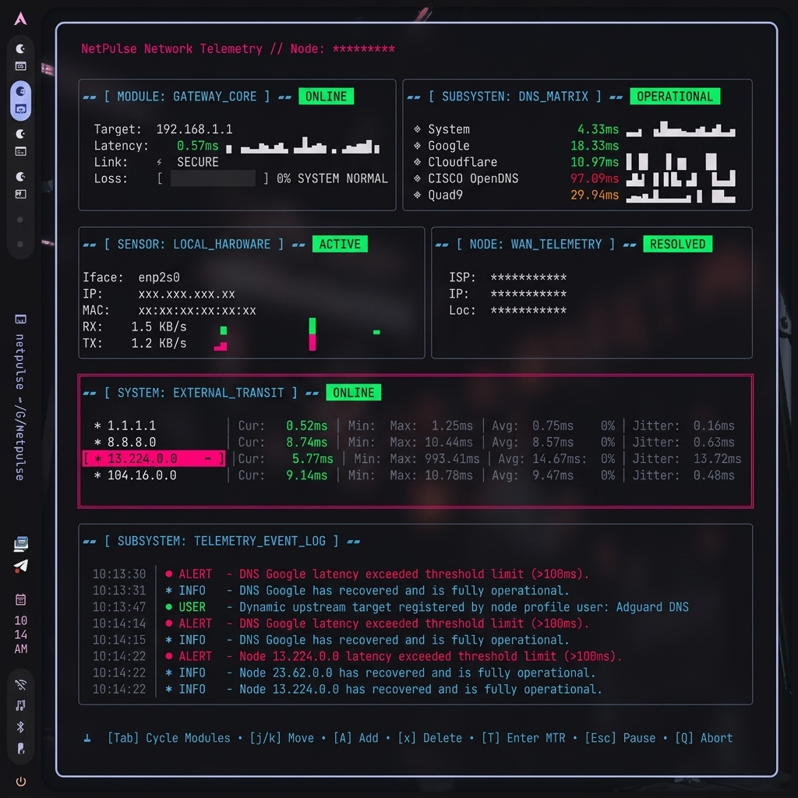

# NetPulse



NetPulse is a zero-dependency, real-time terminal network diagnostic tool designed for Linux. It concurrently checks local gateway latency, public DNS resolution speeds, and external packet loss, rendering the live metrics in a beautiful, highly interactive dashboard grid.

## 🚀 Key Features
- **Visual Sparkline Graphs**: Elastic Braille-character line graphs provide a real-time historical timeline of your connection jitter and active hardware network throughput (RX/TX).
- **Dynamic Diagnostics**: Tracks your Default Gateway, Public DNS instances, and External Backbones concurrently using asynchronous goroutines.
- **Statistical Matrices**: Calculates Min, Max, Avg, and Jitter on the fly for all nodes.
- **Telemetry Event Log**: An embedded, timestamped, colored logging stream for all timeouts, user interactions, and recovery states.
- **Interactive TUI**: Add `[A]`, Rename `[Enter]`, and Delete `[x]` nodes directly from the UI without touching the configuration file.
- **Integrated MTR / Traceroute**: Press `T` to instantly map network hops directly to the target routing endpoint.
- **Background Daemon Mode**: Log metrics into the background (`~/.local/share/netpulse/metrics.log`) and trigger Linux DBus desktop alerts on connection failures.

## 🛠️ Installation

The easiest way to install NetPulse and ensure that it has the correct system permissions is to compile it using the included Makefile. This installs the binary directly to `/usr/local/bin` so it is globally available to your user and `sudo`.

```bash
git clone https://github.com/ibfavas/netpulse.git
cd netpulse
make install
```

*(This command will request your `sudo` password to copy the binary and automatically apply `setcap cap_net_raw+ep` to it, granting it raw socket privileges out-of-the-box.)*

## 🎮 Usage & Keyboard Shortcuts

| Command | Mode | What It Does |
|---------|------|--------------|
| `netpulse` | Standard | Launches the live TUI dashboard using built-in raw socket capabilities. |
| `sudo netpulse` | Elevated | Launches the tool directly as root (supported natively since it is installed in `/usr/local/bin`). |
| `netpulse --daemon` | Background | Launches quietly into background monitoring mode writing to your local log file and notifying the desktop of major outages. |
| `netpulse -demo` | Showcase | Replaces MAC address, Hardware IP, WAN location, and Node Hostname with redacted placeholders (perfect for generating clean screenshots for GitHub). |

Once the dashboard is active on your screen, the Bubble Tea engine captures the following inputs:

| Key Binding | Action | Description |
|-------------|--------|-------------|
| `Tab` / `Left` / `Right`| Focus Component | Cycles your active layout focus between the diagnostic panels, highlighting the active target. |
| `Up` / `Down` | Cursor Navigation | Moves the active cursor up and down through the list of targets within the focused panel. |
| `A` or `a` | Add Node | Focuses the footer prompt to dynamically type and register new DNS or Backbone targets directly into the active configuration. |
| `x` or `X` | Delete Node | Immediately removes the currently highlighted custom node from the config array. |
| `Enter` | Rename / Trace | Renames DNS nodes, or launches a full-screen interactive Traceroute grid while focused on the Backbone panel. |
| `+` / `-` | Scale Tick Rate | Increase polling rate (up to 250ms) for high-precision jitter hunting, or decrease it (down to 5s) for background bandwidth-saving. |
| `Space` or `R` | Force Refresh | Bypasses the interval timer and immediately fires off an asynchronous network probe cycle across all diagnostics. |
| `Esc` | Pause / Back | Freezes the active updates on the display. If currently inside the MTR window, it returns control to the dashboard. |
| `q` or `Ctrl+C` | Graceful Exit | Terminates all background monitoring goroutines cleanly and restores the terminal buffer. |

## ⚙️ Build from Source (Makefile)
You can test and compile from the code repository directly using the configured Makefile:
```bash
make          # Formats and builds a local `./netpulse` binary
make install  # Builds and installs globally into your Go bin path
```
