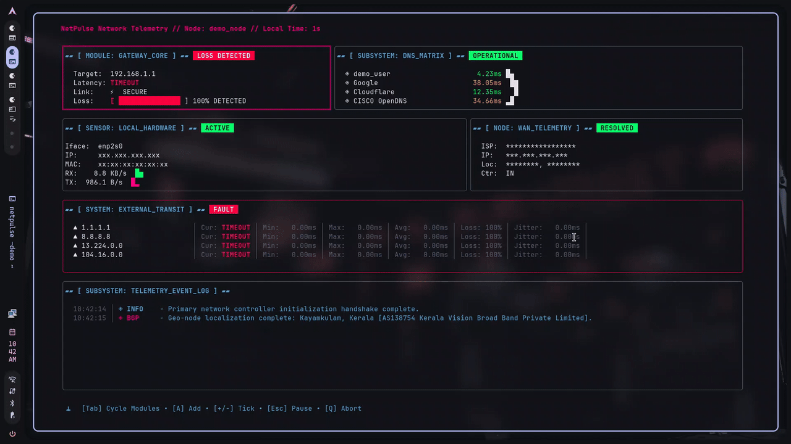

# NetPulse ⚡



NetPulse is a zero-dependency, high-density real-time network diagnostic telemetry HUD designed exclusively for Linux. Written entirely in Go using the **Charmbracelet Bubble Tea** framework, it aggregates critical network path diagnostics, interface I/O streams, and ISP metadata into a cohesive, keyboard-driven Cyberpunk/Sci-Fi tactical command dashboard.

Instead of running separate windows for `ping`, `mtr`, `dig`, and `nload`, NetPulse runs them concurrently via non-blocking asynchronous Goroutines ensuring zero interface lag even during severe packet drops or connection failure loops.

---

## 🎮 Interface Architecture & Modules

### 1. ▰▰ [ MODULE: GATEWAY_CORE ] ▰▰
- Active monitoring of the local default gateway (automatically parsed via system routing paths).
- Live Braille-based latency sparklines mapping local link reliability.
- Unprivileged packet fallback handling when running without root capabilities.

### 2. ▰▰ [ SUBSYSTEM: DNS_MATRIX ] ▰▰
- Real-time resolution benchmark testing across multiple custom and public DNS clusters (System, Cloudflare, Google, Quad9, OpenDNS).
- **Interactive Matrix Extension:** Use the context-aware input engine to append custom upstream resolvers on the fly.

### 3. ▰▰ [ SENSOR: LOCAL_HARDWARE ] & [ NODE: WAN_TELEMETRY ] ▰▰
- Parses low-level Linux networking layers to track real-time interface throughput throughput delta lines (`RX / TX` speeds).
- Automated BGP Autonomous System Number (ASN) mapping, WAN validation, and ISP provider identification.

### 4. ▰▰ [ SYSTEM: EXTERNAL_TRANSIT ] ▰▰
- High-density tabular metrics tracking critical backbones.
- Calculates **Current RTT, Minimum, Maximum, Average, Packet Loss, and Jitter** concurrently.
- Supports **Interactive Full-Screen MTR** mode tracing individual network hops.

### 5. ▰▰ [ SUBSYSTEM: TELEMETRY_EVENT_LOG ] ▰▰
- A scrolling operational ring buffer console. It actively hooks and prints diagnostic system notifications, alert thresholds, and user inputs dynamically.

---

## 🕹️ Interactive Keyboard Matrix

| Key Binding | Action | Contextual Description |
| :--- | :--- | :--- |
| `Tab` | **Cycle Modules** | Shifts focus between panels, modifying the active LipGloss highlight border. |
| `A` | **Add Host** | Context-aware target injection. Appends DNS servers or WAN targets depending on focused panel. |
| `X` | **Delete Host** | Safely removes user-defined dynamic monitoring targets. |
| `R` | **Rename Host** | Modifies the visible name tag string of custom telemetry nodes. |
| `Enter` / `T` | **MTR Mode** | Triggers an interactive full-screen intermediate routing traceroute chart. |
| `+` / `-` | **Scale Tick Rate** | Scales the polling speed between high-precision `250ms` loops and slow `5s` checks. |
| `Esc` | **Pause Viewport** | Freezes the active UI rendering context loop to lock anomalies onto the screen. |
| `Q` / `Ctrl+C` | **Abort Execution**| Safely tears down the async monitoring routines and returns control to the shell. |

---

## 🚀 Installation

### 1. Compile Globally via Go Toolchain
If you have the Go runtime configured on your system, you can fetch, compile, and install NetPulse with one command:

```bash
go install github.com/ibfavas/netpulse/cmd/netpulse@latest
```

### 2. Build from Source (Makefile)
You can also clone the repository and compile using the included Makefile. This installs the binary directly to `/usr/local/bin` granting it proper raw socket capabilities natively:

```bash
git clone https://github.com/ibfavas/netpulse.git
cd netpulse
sudo make install
```

### 3. Usage & Daemon Mode
Once installed, simply run it:

```bash
netpulse          # Standard launch
sudo netpulse     # Elevated launch (for raw ICMP/MTR capabilities)
netpulse --daemon # Headless background mode logging to ~/.local/share/netpulse/metrics.log
netpulse -demo    # Showcase mode for scrubbing PII data when taking screenshots
```
